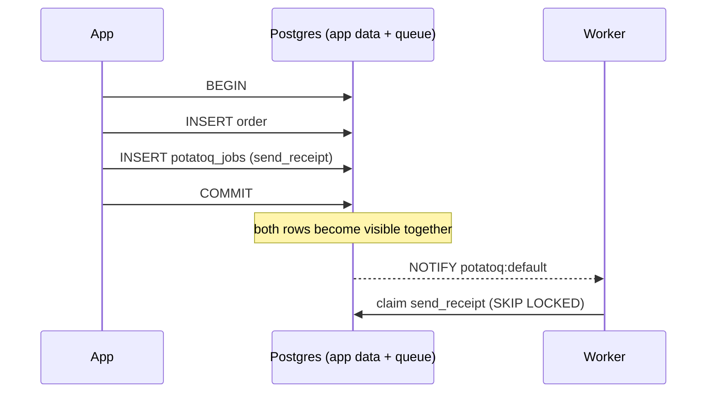

# Tasks and database transactions

The most common Celery bug in web apps looks like this:

```python
with transaction.atomic():
    order = Order.objects.create(...)
    send_receipt.delay(order.id)     # Celery publishes NOW...
# ...and a fast worker runs send_receipt before COMMIT: Order.DoesNotExist
```

A rollback is just as bad: the task runs for data that never existed.

## What potatoq does

Inside a transaction (Django `atomic()` or `ATOMIC_REQUESTS`, or an SQLAlchemy session
that has written or added something), `delay()` **waits for the commit**:

- **COMMIT** → the task is sent
- **ROLLBACK** → the task is never sent
- **no transaction** → sent immediately

When the broker **is** that database (the Postgres or SQLite broker on the same
database), potatoq goes one better: it writes the task row through your connection,
inside your transaction. You get the same semantics, minus the small window in which a
process crash between COMMIT and publishing would lose the task. This is the
transactional outbox pattern, with no extra code.



## Controlling it

```python
@shared_task(enqueue_on_commit=False)   # this task is always sent immediately
def audit(event): ...

send_receipt.apply_async((order.id,), enqueue_on_commit=False)   # this call only
send_receipt.delay_on_commit(order.id)                           # Celery 5.4 API, always deferred
send_receipt.apply_async((order.id,), using="replica_db")        # Django: another database alias
```

Set `task_enqueue_on_commit = False` to turn this off app-wide.

## If sending fails after COMMIT

With Redis or RabbitMQ, deferred tasks are sent right after COMMIT. If the broker is
unreachable then (after about a second of retries), the data is already committed but
the tasks aren't sent:

- each lost task is logged at ERROR on the `potatoq` logger, with its name, id and queue;
- `potatoq.exceptions.EnqueueAfterCommitError` (an `OperationalError`, with the
  `task_ids`) is raised where the transaction committed: out of the `atomic()` block in
  Django, or as a 500 with `ATOMIC_REQUESTS`. Django skips the remaining `on_commit`
  callbacks of that transaction, as it does for any failing callback. With SQLAlchemy,
  `commit()` doesn't raise; the rest of the callbacks still run.

This is how Celery's `delay_on_commit`, Rails, Sidekiq and Laravel behave too. Plain
Celery `.delay()` fails inside the block and rolls back instead, but then a fast worker
can run the task before the data it needs is committed.

```python
from potatoq.exceptions import EnqueueAfterCommitError

try:
    with transaction.atomic():
        order = Order.objects.create(...)
        send_receipt.delay(order.id)
except EnqueueAfterCommitError as exc:
    ...  # the order exists; exc.task_ids weren't sent
```

If losing a task this way isn't acceptable, use the Postgres (or SQLite) broker on the
same database: the task row is part of your transaction, so it commits or rolls back with
your data.

!!! note "Django tests"
    `TestCase` wraps each test in a transaction that never commits, so deferred tasks
    are never sent. Use `TransactionTestCase`, Django's
    `captureOnCommitCallbacks(execute=True)`, or `task_always_eager = True`, which runs
    `.delay()` immediately (`delay_on_commit()` still waits for the commit, as in
    Celery).

See [Django](../integrations/django.md) and [SQLAlchemy](../integrations/sqlalchemy.md) for setup.
