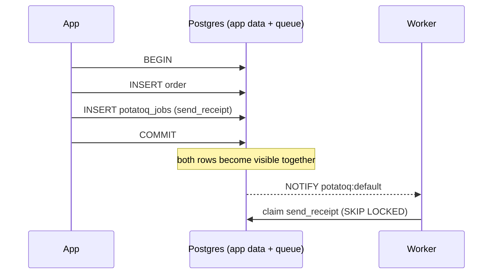

# Tasks and database transactions

The most common Celery bug in web apps looks like this:

```python
with transaction.atomic():
    order = Order.objects.create(...)
    send_receipt.delay(order.id)     # Celery publishes NOW...
# ...and a fast worker runs send_receipt before COMMIT: Order.DoesNotExist
```

A rollback is just as bad: the task runs for data that never existed.

## What potatoq does

Inside a transaction (Django `atomic()` or `ATOMIC_REQUESTS`, or an SQLAlchemy session
that has written something), `delay()` **waits for the commit**:

- **COMMIT** → the task is sent
- **ROLLBACK** → the task is never sent
- **no transaction** → sent immediately

When the broker **is** that database (the Postgres or SQLite broker on the same
database), potatoq goes one better: it writes the task row through your connection,
inside your transaction. You get the same semantics, minus the small window in which a
process crash between COMMIT and publishing would lose the task. This is the
transactional outbox pattern, with no extra code.



## Controlling it

```python
@shared_task(enqueue_on_commit=False)   # this task is always sent immediately
def audit(event): ...

send_receipt.apply_async((order.id,), enqueue_on_commit=False)   # this call only
send_receipt.delay_on_commit(order.id)                           # Celery 5.4 API, always deferred
send_receipt.apply_async((order.id,), using="replica_db")        # Django: another database alias
```

Set `task_enqueue_on_commit = False` to turn this off app-wide.

!!! note "Django tests"
    `TestCase` wraps each test in a transaction that never commits, so deferred tasks
    are never sent. Use `TransactionTestCase`, Django's `captureOnCommitCallbacks()`, or
    `task_always_eager = True`, which runs tasks immediately.

See [Django](../integrations/django.md) and [SQLAlchemy](../integrations/sqlalchemy.md) for setup.
