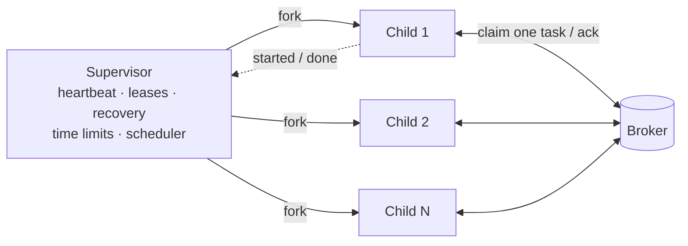

# Workers

```console
$ potatoq -A proj worker -Q default,emails -c 8 -l info
```

| Flag | Default | |
|---|---|---|
| `-A`, `--app` | Django's app if `DJANGO_SETTINGS_MODULE` is set | `proj`, `proj.tasks`, or `proj.tasks:app` |
| `-Q`, `--queues` | `default` | Comma-separated; consumed fairly |
| `-c`, `--concurrency` | CPUs available to the process | Respects CPU affinity and cgroup quotas |
| `-l`, `--loglevel` | `INFO` | |
| `-P`, `--pool` | `prefork` | `solo` runs tasks in-process, one at a time (works with `pdb`) |
| `--max-tasks-per-child` | `1000` | Recycle processes to contain memory leaks |
| `--max-memory-per-child` | off | `512MB`, `2GiB`, or KiB like Celery |
| `--shutdown-timeout` | `25` | Seconds running tasks get on `SIGTERM` |
| `--time-limit`, `--soft-time-limit` | 1800 / auto | App-wide defaults |
| `--no-scheduler` | | Don't run periodic tasks on this worker |
| `-n`, `--hostname` | `potatoq@<host>` | |

Celery's `-B`, `-O fair`, `-E`, `--autoscale`, `--prefetch-multiplier`, `--without-gossip`,
`--without-mingle` and `--without-heartbeat` are accepted and ignored: each is either the
default or unnecessary.

## How it works



- **The supervisor** never runs tasks and is single-threaded, so it can always fork
  replacement processes safely. It heartbeats the node, extends the leases of running
  tasks, recovers tasks of dead nodes, kills processes that blow their hard time limit,
  and runs the scheduler.
- **Each child** owns its broker connection and claims exactly one task when idle. While
  idle it blocks on the broker's wake-up mechanism, so it doesn't busy-poll. It reports
  each task it starts to the supervisor over a pipe, so the supervisor can requeue that
  task if the child dies.

## Shutdown

| Signal | Effect |
|---|---|
| `SIGTERM` / first `Ctrl-C` | Stop taking tasks, let running ones finish for `--shutdown-timeout` (25 s), then interrupt and requeue them without counting a delivery |
| second `Ctrl-C`, `SIGQUIT` | Interrupt and requeue running tasks now |

25 seconds fits inside Kubernetes' and Heroku's 30-second grace periods. Set your
`terminationGracePeriodSeconds` a few seconds above `--shutdown-timeout`.

## Signals

The usual Celery signals are available from `potatoq.signals`: `task_prerun`,
`task_postrun`, `task_success`, `task_failure`, `task_retry`, `task_revoked`,
`task_rejected`, `task_unknown`, `before_task_publish`, `after_task_publish`,
`worker_init`, `worker_ready`, `worker_process_init`, `worker_process_shutdown`,
`worker_shutting_down`, `worker_shutdown`, `beat_init`, `setup_logging` and
`after_setup_logger`.

```python
from potatoq.signals import worker_process_init


@worker_process_init.connect
def init(**kwargs):
    # Runs in every freshly forked child: open per-process clients here.
    ...
```

## Logging

The worker only configures logging if nothing else has. It never replaces handlers you
set up (Celery hijacks the root logger by default). Records emitted inside a task carry
`task_id` and `task_name`.

## Inspecting

```console
$ potatoq -A proj status
potatoq@web-1:4121:9c1e2a: queues=default concurrency=8 running=3 heartbeat=2s ago
$ potatoq -A proj inspect active
```

Liveness comes from the heartbeats workers write to the broker. There are no broadcast
round trips and no gossip.
