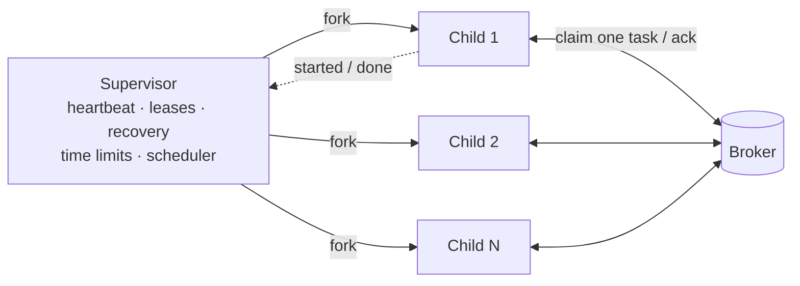

# Workers

```console
$ potatoq -A proj worker -Q default,emails -c 8 -l info
```

| Flag | Default | |
|---|---|---|
| `-A`, `--app` | Django's app if `DJANGO_SETTINGS_MODULE` is set | `proj`, `proj.tasks`, or `proj.tasks:app` |
| `-Q`, `--queues` | `default` | Comma-separated; consumed fairly |
| `-c`, `--concurrency` | CPUs available to the process | Worker processes; respects CPU affinity and cgroup quotas |
| `-t`, `--threads` | `1` | Task threads per process. See [threads](#threads) before raising it |
| `-l`, `--loglevel` | `INFO` | |
| `-P`, `--pool` | `prefork` | `solo` runs tasks in-process, one at a time (works with `pdb`), without time limits, scheduling periodic tasks only between tasks; `threads` = `-c 1 --threads N` as in Celery |
| `--max-tasks-per-child` | `1000` | Recycle processes to contain memory leaks |
| `--max-memory-per-child` | off | `512MB`, `2GiB`, or KiB like Celery |
| `--shutdown-timeout` | `25` | Seconds running tasks get on `SIGTERM` |
| `--time-limit`, `--soft-time-limit` | 1800 / auto | App-wide defaults |
| `--no-scheduler` | | Don't run periodic tasks on this worker |
| `-n`, `--hostname` | `potatoq@<host>` | `%h` (host.domain), `%n` (host) and `%d` (domain) are expanded, as in Celery |

Celery's `-B`, `-O fair`, `-E`, `--autoscale`, `--prefetch-multiplier`, `--without-gossip`,
`--without-mingle` and `--without-heartbeat` are accepted and ignored: each is either the
default or unnecessary.

## How it works



- **The supervisor** never runs tasks and is single-threaded, so it can always fork
  replacement processes safely. It heartbeats the node, extends the leases of running
  tasks, recovers tasks of dead nodes, kills processes that blow their hard time limit,
  and runs the scheduler.
- **Each child** (or each thread in it, with `--threads`) owns its broker connection and claims exactly one task when idle. While
  idle it blocks on the broker's wake-up mechanism, so it doesn't busy-poll. It reports
  each task it starts to the supervisor over a pipe, so the supervisor can requeue that
  task if the child dies.

!!! note "macOS"
    On macOS the worker restarts itself once at startup (same PID, same arguments) with
    `OBJC_DISABLE_INITIALIZE_FORK_SAFETY=YES`. Without it, macOS kills forked processes
    that touch some system frameworks, such as `socket.getfqdn()` in Django's
    `send_mail`, once the parent has started a thread. Many SDKs start one at import
    (logfire, Sentry, New Relic). The variable only works when set before the process
    starts, so setting it yourself skips the restart.

## Threads

Processes are the safe default: one task per process, killable, isolated. Most real tasks
spend their time waiting on HTTP calls, email or the database, though, and one process
per waiting task costs 50–150 MB each. `--threads` runs several tasks per process:

```console
$ potatoq -A proj worker -c 4 --threads 8      # 4 processes x 8 threads = 32 tasks at once
```

Each thread fetches and runs one task at a time with its own broker connection, so
nothing is prefetched or held hostage. Use threads when your tasks are I/O-bound **and
thread-safe**: no shared mutable module state, and thread-safe client libraries.

!!! warning "How time limits work with threads"
    CPython can't kill a single thread, only a whole process. With `--threads` above 1:

    - **Soft time limit**: `SoftTimeLimitExceeded` is *injected* into the task's thread
      and raised at the next Python instruction it runs. A thread blocked **inside a C
      call** (a socket read without a timeout, a long NumPy operation, `time.sleep(600)`)
      only sees it when that call returns. With `--threads 1` the soft limit is a signal
      and also interrupts blocking calls. Give your network calls timeouts either way.
    - **Hard time limit**: still enforced, by killing the **whole process**. The task that
      overran is marked failed with `TimeLimitExceeded`. Every *other* task running in that
      process is interrupted too, and requeued without counting as a failed delivery: it
      runs again from the start on another process, so it must be idempotent. (Except on
      RabbitMQ, where it does count, see [known issues](../wishlist.md#workers-with-threads).)
    - **Shutdown**: on `SIGTERM` running tasks get `--shutdown-timeout` to finish, then
      `WorkerTerminate` is injected the same way (and the process killed 5 s later if a
      thread is stuck in C code). Interrupted tasks are requeued without penalty.

    For comparison, Celery's `--pool=threads` silently ignores both time limits.

`async def` tasks are cancelled cleanly at their soft limit in either mode.

### Free-threaded Python

On a free-threaded build (`python3.14t`, `python3.15t`) threads run Python code truly in
parallel, so `--threads` helps CPU-bound tasks too, not only I/O-bound ones. potatoq is
pure Python and doesn't re-enable the GIL. Check your own dependencies' C extensions,
since an extension that doesn't declare free-threading support turns the GIL back on.
The test suite runs on 3.14t and 3.15t and checks that four CPU-bound tasks in one
process each get nearly a full core.

`benchmarks/cpu.py` runs 400 CPU-bound tasks (a pure-Python loop, about 40 ms each) on
Redis (Apple M3 Max, median of 2 runs). Speedup is over one process on the same
interpreter; memory is the RSS of the whole worker:

| Python | 1 process | 4 processes (`-c 4`) | 4 threads in 1 process (`-c 1 -t 4`) |
|---|---:|---:|---:|
| 3.14, with the GIL | 25 tasks/s, 69 MB | 99 tasks/s (4.0×), 146 MB | 26 tasks/s (1.1×), 70 MB |
| **3.14t, free-threaded** | 27 tasks/s, 78 MB | 107 tasks/s (4.0×), 166 MB | **91 tasks/s (3.4×), 87 MB** |
| 3.15 rc3, with the GIL | 19 tasks/s, 70 MB | 74 tasks/s (3.9×), 151 MB | 19 tasks/s (1.0×), 72 MB |
| **3.15t rc3, free-threaded** | 20 tasks/s, 80 MB | 79 tasks/s (4.0×), 172 MB | **67 tasks/s (3.4×), 90 MB** |

With the GIL, threads don't speed up CPU-bound work at all. Without it, 4 threads get
most of the way to 4 processes in about half the memory. A bare `ThreadPoolExecutor`
running the same loop scales about as well, so the gap is the interpreter's, not
potatoq's. For CPU-bound work processes are still the fastest option; threads on a
free-threaded build are the leaner one.

## Shutdown

| Signal | Effect |
|---|---|
| `SIGTERM` / first `Ctrl-C` | Stop taking tasks, let running ones finish for `--shutdown-timeout` (25 s), then interrupt and requeue them without counting a delivery |
| second `Ctrl-C`, `SIGQUIT` | Interrupt and requeue running tasks now |
| `SIGHUP` | Reload: stop like `SIGTERM`, then start again in the same process (same PID) with the code and settings on disk now |

### Reloading with SIGHUP

As with gunicorn, `kill -HUP <pid>` after a deploy makes the worker pick up the new code
without your process manager restarting it:

1. The worker stops taking tasks. Running ones finish (up to `--shutdown-timeout`; any
   still running then are requeued without counting a delivery, as on `SIGTERM`).
2. Once they're done, the worker replaces itself with a fresh run of the same command
   (`os.execv`): same PID, same arguments and environment. Python starts from scratch,
   so the new code, settings and task list are loaded, and new child processes are
   forked from that.

No task is lost or run twice, but new tasks wait until the reload is done (typically a
second or two plus your longest running task). Unlike gunicorn, potatoq can't overlap old
and new processes: the worker loads your app once and forks its processes from it, so
fresh processes alone would still run the old code. Child processes ignore `SIGHUP`, so
closing the terminal a worker runs in reloads it instead of killing its processes.

25 seconds fits inside Kubernetes' and Heroku's 30-second grace periods. Set your
`terminationGracePeriodSeconds` a few seconds above `--shutdown-timeout`.

### systemd

```ini title="/etc/systemd/system/myapp-worker.service"
[Unit]
Description=myapp potatoq worker
After=network.target postgresql.service

[Service]
WorkingDirectory=/srv/myapp
Environment=DJANGO_SETTINGS_MODULE=mysite.settings
ExecStart=/srv/myapp/.venv/bin/python manage.py potatoq worker -c 2
# systemctl reload: pick up new code in place (see "Reloading with SIGHUP")
ExecReload=/bin/kill -HUP $MAINPID
Restart=always
# Send SIGTERM to the supervisor only, and let it stop its processes.
KillMode=mixed
TimeoutStopSec=35

[Install]
WantedBy=multi-user.target
```

In unit files systemd expands `%h` itself (to the home directory), so write `-n
worker@%%h` to pass potatoq's `%h`, or leave `-n` out. If `ExecStart` goes through a wrapper (a shell script, `uv run`), start the worker with
`exec` (`exec uv run potatoq worker …`) so the wrapper doesn't stay around as an extra
process that forwards its own copy of every signal. potatoq copes with duplicate signals,
but the process tree is simpler. One unit per host is enough: there is no `multi` command to manage, and no separate
`beat` service, because every worker runs the scheduler. Restart workers one at a time
when deploying to several hosts, so periodic runs aren't missed
([details](periodic-tasks.md#missed-runs)). Wrappers like `newrelic-admin run-program`
go in front of `python` as usual.

## Signals

The usual Celery signals are available from `potatoq.signals`: `task_prerun`,
`task_postrun`, `task_success`, `task_failure`, `task_retry`, `task_revoked`,
`task_rejected`, `task_unknown`, `before_task_publish`, `after_task_publish`,
`worker_init`, `worker_ready`, `worker_process_init`, `worker_process_shutdown`,
`worker_shutting_down`, `worker_shutdown`, `beat_init`, `setup_logging` and
`after_setup_logger`.

```python
from potatoq.signals import worker_process_init


@worker_process_init.connect
def init(**kwargs):
    # Runs in every freshly forked child: open per-process clients here.
    ...
```

## Logging

On a terminal the worker's log reads like FastAPI's: a column of colored tags, and one
line per task attempt saying what happened and how long it took.

```console
$ potatoq -A proj worker
12:00:01    potatoq   🥔 Worker potatoq@web-1 is ready (potatoq 26.1)
12:00:01     broker   redis://localhost:6379/0
12:00:01    results   not stored by default (backend redis://localhost:6379/0)
12:00:01     queues   default
12:00:01    workers   4 processes
12:00:01     limits   30m00s per task, new process every 1000 tasks
12:00:01   schedule   1 periodic task
12:00:01      tasks   3 registered: shop.charge, shop.refund, shop.send_receipt
12:00:01   schedule   nightly → shop.report, 0 3 * * *, next run 2026-10-10 03:00:00 UTC
12:00:02       INFO   ✅ shop.send_receipt[3f2a91c4-…] succeeded in 12ms
12:00:02       INFO   🔁 shop.charge[9c1d0e7b-…] failed in 31ms, will retry in 8.78s: TimeoutError('gateway')
12:00:03      ERROR   ❌ shop.refund[51b0c2aa-…] failed in 2ms: ValueError('never charged')
Traceback (most recent call last):
  File "/app/shop/tasks.py", line 42, in refund
    raise ValueError("never charged")
ValueError: never charged
```

Tracebacks start at your task, without potatoq's own frames. When the output isn't a
terminal (a file, journald, a container's log collector), each record is one plain
line instead, Celery-style:

```text
[2026-10-09 12:00:02,120: INFO/ForkPoolWorker-1] ✅ Task shop.send_receipt[3f2a91c4-…] succeeded in 12ms
```

Colors only go to terminals, and follow [`NO_COLOR`](https://no-color.org) and
`FORCE_COLOR`. Emojis are on unless you set `POTATOQ_NO_EMOJI=1`. `potatoq --no-color`
and `--no-emoji` (or the `worker_log_color` and `worker_log_emoji` settings) turn them
off, and `--color` forces colors on. Setting `worker_log_format` (Celery's format string)
switches to that format as given.

The messages themselves stay plain text: colors, emojis and the gutter are added by the
handler potatoq installs, so other handlers and JSON log processors get clean records.
Task outcomes carry `potatoq_event` (`success`, `retry`, `failure`, …), `task_name`,
`task_id` and `runtime` as record attributes.

The worker only configures logging if nothing else has. It never replaces handlers you
set up (Celery hijacks the root logger by default). Records emitted inside a task carry
`task_id` and `task_name`.

So in a Django project with its own `LOGGING`, the worker's lines look like the rest of
your logs. If your root handler has no formatter, they have no timestamp or level
either; add one, for example:

```python title="settings.py"
LOGGING = {
    "version": 1,
    "formatters": {"plain": {"format": "[%(asctime)s %(levelname)s %(processName)s] %(message)s"}},
    "handlers": {"console": {"class": "logging.StreamHandler", "formatter": "plain"}},
    "root": {"handlers": ["console"], "level": "INFO"},
}
```

## Inspecting

```console
$ potatoq -A proj status
    workers   2 live

             WORKER                       QUEUES    CONCURRENCY   RUNNING   HEARTBEAT
             🟢 potatoq@web-1:4121:9c1e2a   default             8         3      2s ago
             🟢 potatoq@web-2:4180:1f0b7d   default       8 (2×4)         1      1s ago
$ potatoq -A proj inspect active
```

Liveness comes from the heartbeats workers write to the broker. There are no broadcast
round trips and no gossip.
